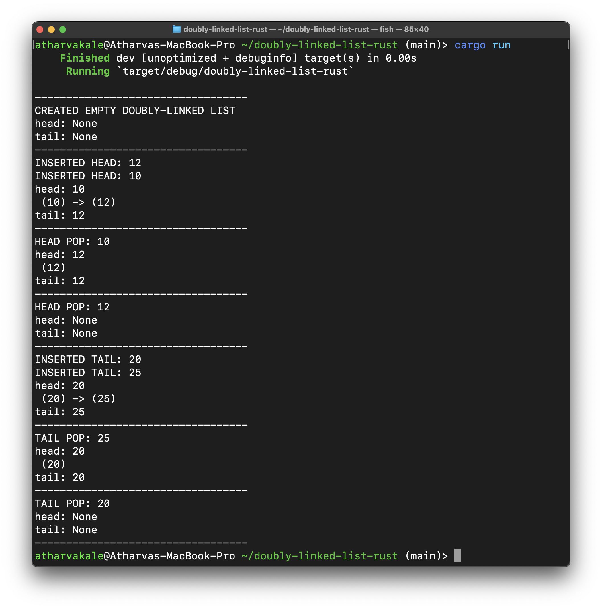

# Doubly-Linked List in Rust

A attempt at creating a doubly-linked list in Rust. This is for recreational purposes only. Do not use linked lists in production code.



# Quick Start
```console 
$ cargo run
```